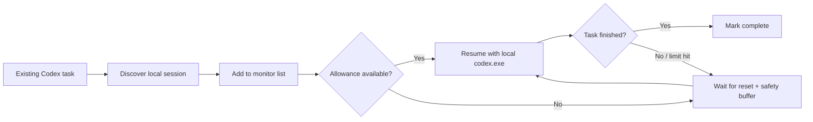

# Five-Hour-Limit-Get-Lost-
让codex持续24小时为你运行，tibo重置前一夜必备
<div align="center">

  

  # Five-Hour Limit, Get Lost!

  **A lightweight, local-first Windows scheduler for unfinished Codex tasks.**

  <p>
    Watch the tasks you already have · wait for the next allowance · resume when it is safe to try again
  </p>

  [](#requirements)
  [](#requirements)
  [](#privacy-first-by-design)
  [](LICENSE)

  <br />

  <sub>Independent community software. Not affiliated with or endorsed by OpenAI.</sub>

</div>

## Why this exists

Long-running coding work should not stop just because a five-hour allowance is temporarily exhausted. **Five-Hour Limit, Get Lost!** keeps an eye on an existing local Codex task and retries it after the next reset window.

It does not create new chats, use a remote service, bypass limits, or modify Codex permissions. It is a small Windows companion that automates the boring “check again later” step.

## At a glance

| | Design choice |
| --- | --- |
| **Scope** | Existing Codex tasks only; no new task creation |
| **Runtime** | Native Windows PowerShell + WinForms |
| **Scheduling** | Automatic local-log detection or a predictable `+5 hours` cycle |
| **Clock** | Windows local system clock; no Internet time service |
| **Storage** | `%LOCALAPPDATA%\\CodexQueueCN\\` on the current user profile |
| **Permissions** | No administrator privileges required |
| **Network** | No server, telemetry, API key, or remote dependency |

## Highlights

<table>
  <tr>
    <td>🧭 <b>Monitor existing work</b><br />Discover recent local Codex sessions instead of asking you to recreate a task.</td>
    <td>⏱️ <b>Two scheduling modes</b><br />Use local reset information when available, or choose a single time and repeat every five hours.</td>
  </tr>
  <tr>
    <td>🛡️ <b>Safe retries</b><br />Keep a configurable buffer after the expected reset before trying again.</td>
    <td>🧹 <b>Simple queue controls</b><br />See status and next-run time, right-click to remove one record, or clear the monitor list.</td>
  </tr>
  <tr>
    <td>📦 <b>Portable source release</b><br />Run from a downloaded folder; the installer only creates a desktop shortcut.</td>
    <td>🔎 <b>Transparent behavior</b><br />Normal local <code>codex exec resume</code> is used; dangerous modes are not enabled automatically.</td>
  </tr>
</table>

## How it works



The scheduler only runs while its window is open (it can be minimized). Finished tasks are not started again. Waiting or interrupted tasks are retried on the next eligible cycle.

## Requirements

- Windows 10 or Windows 11.
- Windows PowerShell 5.1, included with supported Windows versions.
- Codex installed and signed in for the current Windows user.
- The local `codex.exe` CLI available on `PATH`, or in the standard Codex installation directory under `%LOCALAPPDATA%\\OpenAI\\Codex\\bin`.

## Quick start

### 1. Install

Download or clone this repository. In the project folder, run:

```powershell
powershell.exe -NoProfile -ExecutionPolicy Bypass -File .\\install.ps1
```

The installer creates a **Five-Hour Limit, Get Lost!** shortcut on the current user's Desktop. It does not require administrator privileges.

Prefer no shortcut? Double-click:

```text
start-five-hour-limit-get-lost.bat
```

### 2. Add a task to the monitor

1. Open or run the task once in Codex so it exists in the local session list.
2. Open the scheduler and click **刷新任务**.
3. Select the existing task.
4. Choose a scheduling mode.
5. Click **开始监控**.

### 3. Choose a scheduling mode

| Mode | Best for | Behavior |
| --- | --- | --- |
| **自动检测（读取本地日志）** | Codex writes a readable reset event to its local session log | Detects the latest reset information on a best-effort basis, then waits and retries. |
| **手动五小时循环（推荐）** | A limit dialog is visible but not recorded in a readable log | Pick one `HH:mm` time. The scheduler repeats it every five hours and waits the configured buffer before retrying. |

Example: choosing `20:32` produces `20:32 → 01:32 → 06:32 → 11:32 → 16:32 → 21:32`.

The default safety buffer is two minutes. The clock and schedule use the Windows local time; this project does not query an Internet clock.

## Queue controls

- **刷新任务** — read recent sessions from the current Windows profile.
- **开始监控** — add or update the selected existing session in the local monitor list.
- **一键全删** — remove all monitor records; it does not delete Codex tasks or project files.
- **右键 → 删除此监控任务** — remove one monitor record.
- **暂停** — stop starting new work while keeping the queue visible.

## Privacy first by design

All state and run output remain on the local machine:

```text
%LOCALAPPDATA%\\CodexQueueCN\\
```

The application:

- does not send telemetry or contact a remote service;
- does not use OpenAI API keys;
- does not read Claude data;
- does not upload prompts, transcripts, project files, or logs;
- does not bypass, extend, or manipulate Codex limits.

Do not commit the local state directory or unredacted run logs to a public repository.

## Repository layout

```text
CodexQueueCN.ps1                 Main Windows scheduler
install.ps1                      Creates the desktop shortcut
uninstall.ps1                    Removes only that shortcut
start-five-hour-limit-get-lost.* Hidden/portable launchers
five_hour_limit_icon.*           Application icon assets
README.md                        Project overview (this file)
README-CN.md                     Short Chinese guide
.github/workflows/validate.yml   Windows script validation
```

## Troubleshooting

<details>
<summary><b>No tasks appear after refreshing</b></summary>

Open or run the task in Codex once, then click **刷新任务** again. The scheduler reads recent sessions from the current user's `.codex` directory; it cannot see tasks belonging to another Windows account.

</details>

<details>
<summary><b>Codex cannot be started</b></summary>

Confirm Codex is installed and signed in. The scheduler checks both `PATH` and the standard `%LOCALAPPDATA%\\OpenAI\\Codex\\bin` location. Restart the scheduler after installing or updating Codex.

</details>

<details>
<summary><b>Automatic detection does not find the reset</b></summary>

Local transcript formats can change between Codex releases. Switch to **手动五小时循环（推荐）**, choose the next expected reset time, and leave the two-minute buffer enabled.

</details>

## Contributing

Bug reports, reproducible examples, documentation improvements, and small compatibility fixes are welcome. Please read [CONTRIBUTING.md](CONTRIBUTING.md) before opening a pull request.

For security-sensitive reports, see [SECURITY.md](SECURITY.md).

## License

Released under the [MIT License](LICENSE).

中文快速说明：[README-CN.md](README-CN.md)
